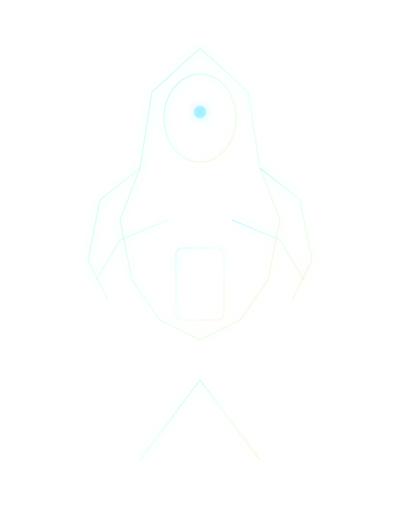
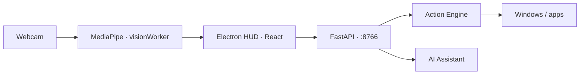

# IA Moves

**IA Moves** es una estación de control gestual para Windows: HUD futurista en Electron, visión por computadora con MediaPipe, control del PC por gestos y core Python (FastAPI) para acciones e IA.

Proyecto independiente — pensado como laboratorio de interacción **cámara + mano + red neural + comandos**, no como app genérica de productividad.

<p align="center">
  
</p>

## Características principales

| Área | Qué hace |
|------|----------|
| **Cinematic Hand Control Lab** | Cámara integrada en el panel, landmarks 21 puntos, red de nodos con glow, partículas reactivas al gesto y HUD tipo AR (nodos cercanos, zoom, telemetría). |
| **Vision Matrix** | Radar holográfico 3D (Three.js) cuando la cámara está apagada; con cámara activa el feed vive en el Hand Lab. |
| **Neural volume** | Escena Babylon.js (toro + ico-esfera) como segundo motor 3D decorativo. |
| **Control Deck** | Acciones reales: Inicio, VS Code, terminal, ventanas, escritorio, click, Escape. |
| **Modo mouse** | Puntero por WebSocket/HTTP con calibración (sensibilidad, suavizado, anti-jitter). |
| **Core API** | Salud, gestos simulados, ejecución de acciones, chat IA, canal WS de control. |

## Arquitectura



Documentación ampliada: [`scripts/docs/ARCHITECTURE.md`](scripts/docs/ARCHITECTURE.md) · gestos: [`scripts/docs/GESTURES.md`](scripts/docs/GESTURES.md) · roadmap: [`scripts/docs/ROADMAP.md`](scripts/docs/ROADMAP.md).

## Estructura del repositorio

```
ia_moves/
├── apps/desktop/          # Electron + React + Vite
│   └── src/features/handLab/   # Cinematic Hand Control Lab (capas HUD)
├── services/core/         # FastAPI, gestos, acciones, IA
├── scripts/               # setup y run (Windows PowerShell)
│   └── docs/              # arquitectura, gestos, roadmap
└── .env.example
```

## Requisitos

- **Node.js** 20+
- **Python** 3.11+ (en PATH)
- **Windows** 10/11
- **Webcam** (para tracking en vivo)
- Opcional: clave **OpenAI** en `.env` para respuestas reales del asistente

## Inicio rápido

### 1. Variables de entorno

```powershell
copy .env.example .env
# Edita .env y agrega OPENAI_API_KEY cuando quieras IA real
```

### 2. Instalar dependencias

```powershell
.\scripts\setup-desktop.ps1
.\scripts\setup-backend.ps1
.\scripts\download-models.ps1   # modelos MediaPipe / WASM (si aplica)
```

### 3. Ejecutar (dos terminales)

```powershell
.\scripts\run-backend.ps1    # API en http://127.0.0.1:8766
.\scripts\run-desktop.ps1    # Electron + Vite en http://127.0.0.1:5173
```

Solo navegador (sin Electron):

```powershell
cd apps/desktop
npm run web
```

Abre **http://127.0.0.1:5173**.

> **Puerto API:** el desktop usa `8766` (ver `run-backend.ps1` y `App.jsx`). Si cambias el puerto, alinea backend y frontend.

## Cinematic Hand Control Lab

Panel principal del antiguo «Atom Lab», ahora como **laboratorio gestual cinemático**:

1. Activa la cámara (**ACTIVAR CÁMARA** o botón en Vision Matrix).
2. El vídeo aparece **dentro** del lab; encima se dibujan landmarks, malla neural y partículas.
3. Los gestos modifican el campo visual y el HUD lateral.

| Gesto | Efecto visual (lab) | Acción sistema (por defecto) |
|-------|---------------------|------------------------------|
| `open_palm` | Expansión del campo | Abrir Inicio |
| `fist` | Colapso / contracción | Mostrar escritorio |
| `point` | Rayo al índice · target lock | Click |
| `pinch` | Anillo de captura · arrastre de nodos | — (manipulación en lab) |
| `thumb_up` | Pulso de confirmación | Confirmar |
| `victory` | Ciclo LAB → COMANDOS → MOUSE | Alternar modo mouse |

**Rendimiento:** selector LOW (300) / MED (800) / CINEMATIC (1500+) partículas en el toolbar del lab.

Módulos clave: `CinematicHandLab.jsx`, `useHandLabFusion.js`, `handLabFusionDraw.js`, `handLabDraw.js`.

## Gestos y seguridad

Todas las acciones del sistema pasan por una **lista permitida** en el backend — ningún gesto ejecuta comandos arbitrarios. Detalle en [`scripts/docs/GESTURES.md`](scripts/docs/GESTURES.md).

## Stack técnico

| Capa | Tecnología |
|------|------------|
| Desktop | Electron, React 19, Vite 6 |
| Visión | MediaPipe Tasks Vision, Web Worker, WASM |
| 3D | Three.js (`@react-three/fiber`), Babylon.js |
| Backend | FastAPI, Uvicorn |
| Control | WebSocket + REST hacia `services/core` |

## Scripts útiles

| Script | Descripción |
|--------|-------------|
| `scripts/setup-desktop.ps1` | `npm install` en `apps/desktop` |
| `scripts/setup-backend.ps1` | venv Python + requirements |
| `scripts/run-backend.ps1` | API local con recarga |
| `scripts/run-desktop.ps1` | `npm run dev` (Vite + Electron) |
| `scripts/download-models.ps1` | Descarga de assets de visión |

## Desarrollo

```powershell
cd apps/desktop
npm run build    # build de producción
npm run web      # solo Vite
```

El Hand Lab evita re-renders por frame: landmarks y fusión neural usan **canvas + `requestAnimationFrame`** y refs para datos de la mano.

## Roadmap

Estado detallado en [`scripts/docs/ROADMAP.md`](scripts/docs/ROADMAP.md). Próximos pasos destacados:

- Capa Three.js con bloom real sobre el feed del Hand Lab
- Gestos más estables y modo pausa global
- Asistente IA con herramientas de workspace
- Voz en tiempo real (Realtime API)

## Licencia y contribución

Proyecto en evolución activa. Issues y PRs en el repositorio remoto.

---

**Repositorio:** [github.com/destruyer212/ia_moves](https://github.com/destruyer212/ia_moves)
