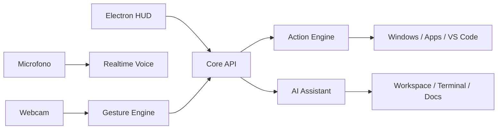

# Arquitectura

## Vision

IA Moves se divide en capas pequeñas para poder construir desde cero sin que el proyecto se vuelva inmanejable.

## Componentes

### Desktop HUD

Ruta: `apps/desktop`

Responsabilidades:

- mostrar panel de estado;
- visualizar gesto activo;
- ejecutar comandos rapidos;
- conversar con el asistente;
- mantener la experiencia visual futurista.

### Core API

Ruta: `services/core`

Responsabilidades:

- recibir estado de gestos;
- ejecutar acciones permitidas;
- servir el historial de eventos;
- conectar OpenAI;
- exponer una API local para la app Electron.

### Gesture Engine

Ruta: `services/core/app/gesture_engine.py`

Primera version:

- modo simulado para desarrollar sin camara;
- estructura lista para conectar MediaPipe.

Version siguiente:

- webcam con OpenCV;
- MediaPipe Gesture Recognizer;
- suavizado de gestos para evitar falsos positivos.

### Action Engine

Ruta: `services/core/app/action_engine.py`

Solo ejecuta acciones registradas. Esto evita que cualquier gesto lance comandos peligrosos.

Ejemplos:

- abrir VS Code;
- abrir terminal;
- cambiar ventana;
- activar/desactivar modo control;
- enviar atajo de teclado.

### AI Assistant

Ruta: `services/core/app/ai_client.py`

Primera version:

- interfaz preparada;
- respuesta local si no hay API key.

Version siguiente:

- OpenAI Responses API para programacion;
- herramientas locales controladas;
- contexto del proyecto;
- voz con Realtime API.

## Flujo de datos

1. El motor de gestos detecta una senal.
2. La API valida si el gesto esta habilitado.
3. El motor de acciones ejecuta solo comandos permitidos.
4. El HUD actualiza estado y muestra eventos.
5. El asistente puede explicar o programar dentro del workspace.

## Principios

- Primero seguridad, despues poder.
- Gestos para acciones rapidas; voz para instrucciones complejas.
- Todo comando del sistema debe pasar por una lista permitida.
- El HUD debe ser util desde la primera pantalla, no una landing page.

